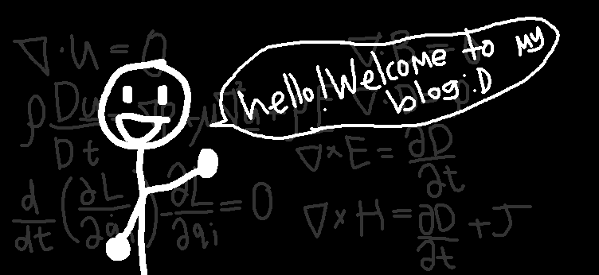

## ebx32's portfolio//blog



```bash
git clone git@github.com:ebx32/ebx32.github.io.git portfolio
cd portfolio
bun install
bun dev
##########
bun run format
bun run format:check
```

### Site configuration

Edit the `src/consts.ts` file to update your site's metadata, navigation links, and social links:

```ts
export const SITE = {
  title: "astro-erudite",
  description: "An opinionated, unstyled blogging template built with Astro.",
  locale: "en-US",
  dir: "ltr",
  defaultPageImage: "/static/opengraph-image.png",
  defaultPostImage: "/static/1200x630.png",
} as const

export const NAVIGATION = [
  { href: "/blog", label: "Blog" },
  // ...
]

export const SOCIALS: { href: string; label: string; icon: SvgComponent }[] = [
  { href: "https://github.com/jktrn", label: "GitHub", icon: GitHub },
  // ...
]
```


### Color palette

Colors are defined in `src/styles/color.css` using the [Radix Colors](https://www.radix-ui.com/colors) scales. Each step carries a light/dark pair via [`light-dark()`](https://developer.mozilla.org/en-US/docs/Web/CSS/Reference/Values/color_value/light-dark) and the semantic tokens point at the scale, so the site respects system preference out of the box and the theme toggle only stores an override:

```css
:root {
  --gray-1:  light-dark(#fcfcfc, #111111);
  /* ... */
  --gray-12: light-dark(#202020, #eeeeee);

  --background:       var(--gray-1);
  --foreground:       var(--gray-12);
  --muted-foreground: var(--gray-11);
  --border:           var(--gray-6);
  /* ... */

  color-scheme: light dark;
}
```

### Favicons

Favicons are generated using [RealFaviconGenerator](https://realfavicongenerator.net/). To adjust the favicons, replace the files in the `public/` directory (such as `favicon.ico`, `favicon.svg`, `apple-touch-icon.png`, etc.) with your own. After updating the favicon files, you'll also need to adjust the references in `src/components/MetaHead.astro` to match your new favicon filenames and paths:

```html
<!-- Replace these with the generated meta tags -->
<link rel="icon" type="image/png" href="/favicon-96x96.png" sizes="96x96" />
<link rel="icon" type="image/svg+xml" href="/favicon.svg" />
<link rel="shortcut icon" href="/favicon.ico" />
<link rel="apple-touch-icon" sizes="180x180" href="/apple-touch-icon.png" />
<meta name="apple-mobile-web-app-title" content="astro-erudite" />
<link rel="manifest" href="/site.webmanifest" />
```

## Adding content

### Blog posts

```yml
---
title: "Your Post Title"
description: "A brief description of your post!"
date: 2026-01-01
order: 0 #opt
authors:
  - enscribe
image: ./assets/banner.png #opt
tags: #opt
  - tag1
  - tag2
draft: false #opt
---
```


### Markdown extensions

A few authoring features exist that extend beyond standard Markdown:

- Callouts use the [directive](https://talk.commonmark.org/t/generic-directives-plugins-syntax/444) syntax, with five variants (`note`, `tip`, `warning`, `caution`, `important`) rendered as collapsible `<details>` elements. Append `{closed}` to start one collapsed:

  ```markdown
  :::note[An optional custom title]
  Hello, world!
  :::
  ```

- Math is written as `$inline$` or `$$display$$` $\LaTeX$ and rendered to MathML at build time.
- Inline code ending in an annotation gets syntax highlighting: `` `const x = 1{:ts}` `` highlights as TypeScript, and `` `text{:.string}` `` paints with the theme's color for a [TextMate scope](https://macromates.com/manual/en/language_grammars).

