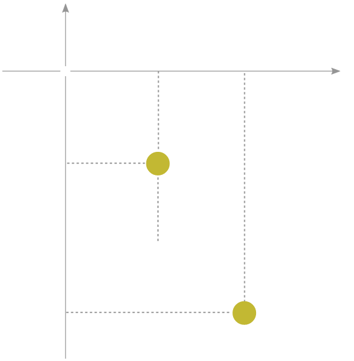

## Objective

**The primary goal of this project was to simulate the motion of a double pendulum using C and Raylib for animation**. While the primary focus was on simulating it by implementing numerical methods such as the fourth-order Runge-Kuta (RK4) method, a significant portion of the project involved deriving the equations of motion of the double pendulum.

One approach was to resolve forces into their horizontal and vertical components and apply Newton's 2nd law of motion, $\vec{F} = m\vec{a}$. However, I achieved this with Lagranging mechanics by considering the total kinetic and potential energies of the system to obtain the Lagrangian $L = T - V$. After finding the Lagrangian, I used the Euler-Lagrange equation, $\frac{d}{dt}\left( \frac{\partial L}{\partial \dot{q}_i} \right) - \frac{\partial  L}{\partial q_i} = 0$, to obtain the coupled second-order non-linear differential equations governing the system. These equations were then solved numerically using the 4th-order Runge-Kutta (RK4) method.

---

## Mathematical Derivation of Equations of Motion

:::note
A lot of the step-by-step working has been condensed for the sake of brevity. You can find everything in the written notes at the end of the page. 
:::

Before we begin we must make 2 main assumptions of the system. The first is that **the bobs are treated as point masses**. This ensures that only their translational motion contributes to the system's dynamics. The next is that **the rods connecting the bobs are massless and rigit**. This means they do not contribute to the system's kinetic and potential energy and serve only to constrain the bob's motion.

Consider the double pendulum shown in the figure above. We used a fixed pivot $O(0, 0)$ as the origin of a Cartesian coordinate system. Let $\theta_1$ and $\theta_2$ be the angles made by the rods with the verticle, and let $L_1$ and $L_2$ be their respective lengths. The masses of bobs $A$ and $B$ are $m_1$ and $m_2$ respectively.

We'll begin by determining the positions $A(x_1, y_1)$ and $B(x_2, y_2)$ of the two bobs.

$$
\begin{align}
x_1 &= L_1 \sin\theta_1 \\
y_1 &= -L_1 \cos\theta_1 \\
x_2 &= L_1 \sin\theta_1 + L_2 \sin\theta_2 \\
y_2 &= -L_1 \cos\theta_1 - L_2 \cos\theta_2 \\
\end{align}
$$

Next we must obtain their velocities, we do this by differentiating the equations above.

$$
\begin{align}
\dot{x}_1 &= L_1 \dot{\theta}_1 \cos\theta_1 \\
\dot{y}_1 &= L_1 \dot{\theta}_1 \sin\theta_1 \\
\dot{x}_2 &= L_1 \dot{\theta}_1 \cos\theta_1  + L_2 \dot{\theta}_2 \cos\theta_2 \\
\dot{y}_2 &= L_1 \dot{\theta}_1 \sin\theta_1 + L_2 \dot{\theta}_2 \sin\theta_2 \\
\end{align}
$$

The Lagrangian equation of a double pendulum is given by $L = T - V$, where $T$ and $V$ are the kinetic and potential energies of the system, respectively. $T$ is given by:

$$
\begin{aligned}
T &= \frac{1}{2} m_1 v_1^2 + \frac{1}{2} m_2 v_2^2 \\
&= \frac{1}{2} m_1 \left( \dot{x}_1^2 + \dot{y}_1^2 \right)
   + \frac{1}{2} m_2 \left( \dot{x}_2^2 + \dot{y}_2^2 \right) \\
&= \frac{1}{2} m_1 L_1^2 \dot{\theta}_1^2
   + \frac{1}{2} m_2 \left(
   L_1^2 \dot{\theta}_1^2
   + L_2^2 \dot{\theta}_2^2
   + 2 L_1 L_2 \dot{\theta}_1 \dot{\theta}_2
   \cos(\theta_1 - \theta_2)
   \right)
\end{aligned}
\tag{9}
$$

We have used the trig identities $\sin^2\theta + \cos^2\theta = 1$ and $\cos\theta_1\cos\theta_2 + \sin\theta_1\sin\theta_2 = \cos(\theta_1 - \theta_2)$ to simplify it tremendously. Moving on, the potential energy $V$ is given by:

$$
\begin{aligned}
V &= m_1 g y_1 + m_2 g y_2 \\
&= -m_1 g L_1 \cos\theta_1 + m_2 g \left( -L_1 \cos\theta_1 - L_2 \cos\theta_2 \right) \\
&= -(m_1 + m_2) g L_1 \cos\theta_1 - m_2 g L_2 \cos\theta_2
\end{aligned}
\tag{10}
$$

The Lagrangian $L$ of the double pendulum, $(9) - (10)$ is therefore:

$$
\begin{aligned}
L &= \frac{1}{2} (m_1 + m_2) L_1^2 \dot{\theta}_1^2
   + \frac{1}{2} m_2 L_2^2 \dot{\theta}_2^2 \\
   &+ m_2 L_1 L_2 \dot{\theta}_1 \dot{\theta}_2 \cos(\theta_1 - \theta_2)
   + (m_1 + m_2) g L_1 \cos\theta_1
   + m_2 g L_2 \cos\theta_2
\end{aligned}
\tag{11}
$$

We now obtain the coupled second-order non-linear differential equations using the Euler-Lagrange equation given by:

$$
\frac{d}{dt}\left(\frac{\partial L}{\partial \dot{q}_i}\right)
-
\frac{\partial L}{\partial q_i}
= 0
$$

The canonical momenta $\left( \frac{\partial L}{\partial \dot{q}_i} \right)$ associated with the coordinates $\theta_1$ and $\theta_2$ can be obtained directly from $L$ for $i = 1, 2$:

$$
\begin{align}
p_{\theta_1}
&= \frac{\partial L}{\partial \dot{\theta}_1} 
= (m_1 + m_2) L_1^2 \dot{\theta}_1
   + m_2 L_1 L_2 \dot{\theta}_2
   \cos(\theta_1 - \theta_2) \\
p_{\theta_2}
&= \frac{\partial L}{\partial \dot{\theta}_2} 
= m_2 L_2^2 \dot{\theta}_2
   + m_2 L_1 L_2 \dot{\theta}_1
   \cos(\theta_1 - \theta_2)
\end{align}
$$

We can use the **product rule** and **chain rule** to differentiate the canonincal momentas $p_{\theta_1}$ and $p_{\theta_2}$ with respect to time.

$$
\begin{aligned}
\frac{dp_{\theta_1}}{dt}

&= (m_1 + m_2)L_1^2\ddot{\theta_1} +
m_2L_1L_2\bigg(\ddot{\theta_2}cos(\theta_1 - \theta_2) - \dot{\theta_2}(\dot{\theta_1} - \dot{\theta_2})sin(\theta_1 - \theta_2)\bigg)\\

&= (m_1 + m_2)L_1^2\ddot{\theta_1} + m_2L_1L_2\ddot{\theta}_2^2\cos(\theta_1 - \theta_2) - m_2L_1L_2\dot{\theta}_1\dot{\theta}_2\sin(\theta_1 - \theta_2) + 
m_2L_1L_2\dot{\theta}_2^2\sin(\theta_1 - \theta_2)
\end{aligned}
\tag{11}
$$

$$
\begin{aligned}
\frac{dp_{\theta_2}}{dt}
&= m_2L_1^2\ddot{\theta_1} + m_2L_1L_2\ddot{\theta}_1\cos(\theta_1 - \theta_2) 
- m_2L_1L_2\dot{\theta}_1^2\sin(\theta_1 - \theta_2) 
+ m_2L_1L_2\dot{\theta}_1\dot{\theta}_2\sin(\theta_1 - \theta_2)
\end{aligned}
\tag{12}
$$

Then we find $$\frac{\partial L}{\partial \theta_i}$$

---

## Obtaining a numerical solution with RK4

---

## Simulating it with C using Raylib

---

## Result

---

## References
