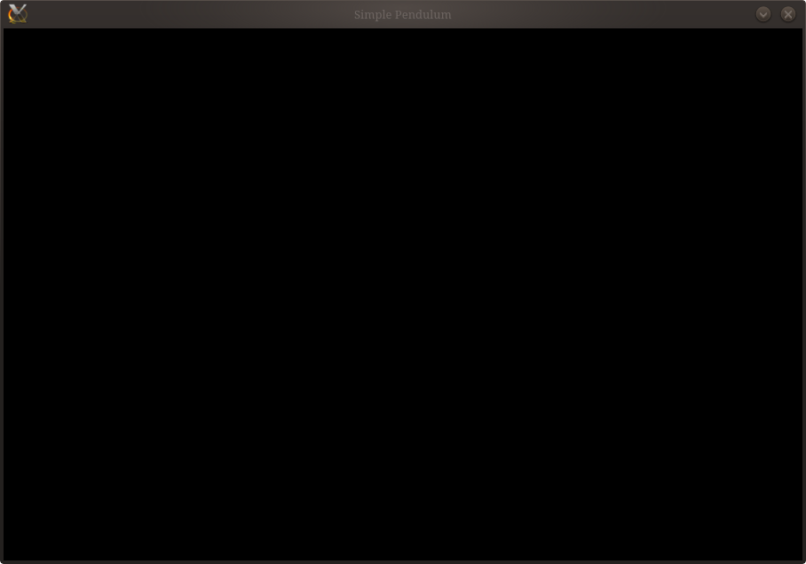
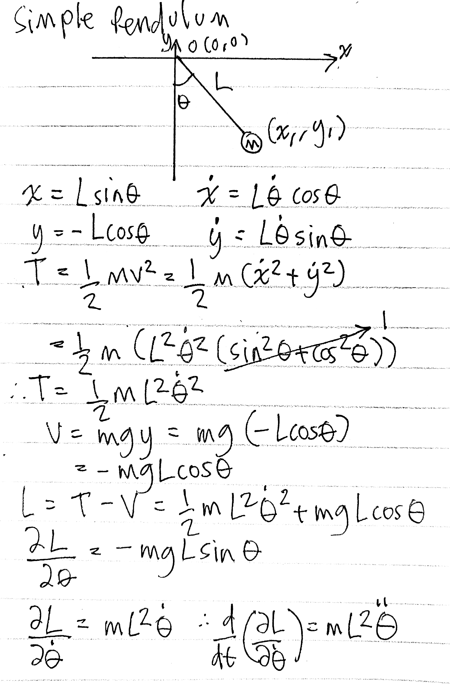
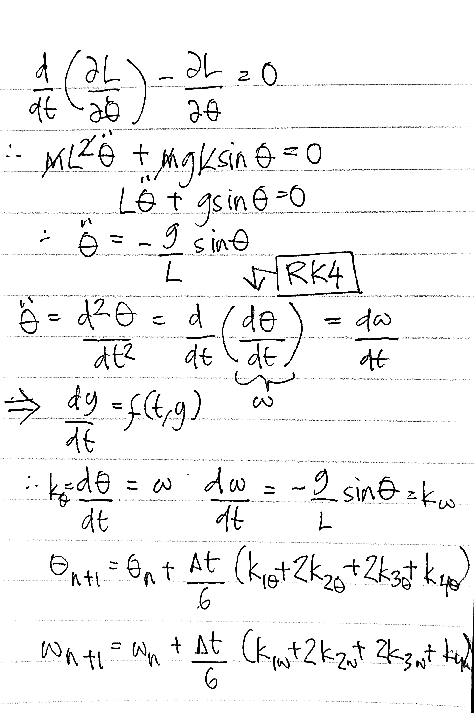

## Introduction and Objective

The main goal of this project is to simulate a simple pendulum (without damping) in C using the raylib graphics library to animate its motion. The equation governing the pendulum's motion is derived using Lagrangian mechanics, which is explained thoroughly throughout this post. I chose this approach because (most) future projects in this series will also use Lagrangian mechanics as the primary method for deriving equations of motion. Moreover, this write-up serves as the first entry in my computational physics series, for which I have many projects planned. For all my posts throughout this series, you can find my handwritten (albeit messy) notes at the very end, which you can navigate to via the right TOC sidebar.

1. Solidify the understanding of 

## Derivation of Equation of Motion

$$
\begin{align}
x &= L\sin\theta \\
y &= L\cos\theta \\
\dot{x} &= L\dot{\theta}\cos\theta \\
\dot{y} &= -L\dot{\theta}\sin\theta
\end{align}
$$

$$
\begin{aligned}
T &= \frac{1}{2}mv^2 = \frac{1}{2}m(\dot{x}^2 + \dot{y}^2) \\
&= \frac{1}{2}m(L^2\dot{\theta}^2\cancelto{1}{(\sin^2\theta + cos^2\theta))} \\
&= \frac{1}{2}mL^2\dot{\theta}^2\
\end{aligned}
\tag{5}
$$

$$
\begin{aligned}
V = mgy = mg(-L\cos\theta) = -mgL\cos\theta
\end{aligned}
\tag{6}
$$

$$
\begin{aligned}
L &= T - V \\
L &= \frac{1}{2}mL^2\dot{\theta}^2 + mgL\cos\theta
\end{aligned}
\tag{7}
$$

$$
\begin{aligned}
\frac{\partial L}{\partial \theta} = -mgL\sin\theta
\end{aligned}
\tag{8}
$$

$$
\begin{aligned}
&p_\theta = \frac{\partial L}{\partial \dot{\theta}} = mL^2\dot{\theta} \\
&\frac{d}{dt}\Bigg(\frac{\partial L}{\partial \dot{\theta}}\Bigg) = \frac{d p_\theta}{dt} = mL^2\ddot{\theta}
\end{aligned}
\tag{9}
$$

$$
\begin{aligned}
\frac{d}{dt}\Bigg(\frac{\partial L}{\partial \dot{\theta}}\Bigg) - \frac{\partial L}{\partial \theta} = 0
\end{aligned}
\tag{10}
$$

$(8)$ $(9)$ into $(10)$

$$
\begin{aligned}
\cancel{m}L^{\cancel{2}}\ddot{\theta} + \cancel{m}g\cancel{L}\sin\theta &= 0 \\
\therefore \space \ddot{\theta} &= -\frac{g}{L}\sin\theta
\end{aligned}
\tag{10}
$$

## Fourth-Order Runge-Kutta (RK4) Method

$$
\frac{dy}{dt} = f(t, y), \space\space y(t_0) = y_0
$$

$$
\begin{align}
y_{n+1} &= y_n + \frac{\Delta t}{6}(k_1 + 2k_2 + 2k_3 + k_4) \\
t_{n+1} &= t_n + \Delta t
\end{align}
$$


$$
\begin{align}
\ddot{\theta} &= \frac{d^2\theta}{dt^2} = \frac{d}{dt}\Bigg(\frac{d\theta}{dt}\Bigg) = \frac{d\omega}{dt} \\
k_\theta &= \frac{d\theta}{dt} = \omega \\
k_\omega &= \frac{d\omega}{dt} = -\frac{g}{L}\sin\theta \\
\end{align}
$$

$$
\begin{align}
\theta_{n+1} &= \theta_n + \frac{\Delta t}{6}(k_{1\theta} + 2k_{2\theta} + 2k_{3\theta} + k_{4\theta}) \\
\omega_{n+1} &= \omega_n + \frac{\Delta t}{6}(k_{1\omega} + 2k_{2\omega} + 2k_{3\omega} + k_{4\omega})
\end{align}
$$

## Simulation in C

```c title="pendulum.c"
#include <raylib.h>

#define WIDTH 900
#define HEIGHT 6000

int main() {
    // initialization goes here
    InitWindow(WIDTH, HEIGHT, "Simple Pendulum");
    
    SetTargetFPS(60);
    while (!WindowShouldClose()) {

        // updating and function call goes here
        
        BeginDrawing();
        ClearBackground(BLACK);

        // drawing goes here
        
        EndDrawing();
    }
    CloseWindow();
    return 0;
}
```

```sh
gcc -Wall -Wextra -Werror pendulum.c -o pendulum -lraylib -lm
```

:::tip[Alternative: Automating compilation with Makefile]
Or alternatively, you can create a `Makefile` and compile your program by running `make` in the terminal.

```Makefile title="Makefile"
CC = gcc
CFLAGS = -Wall -Wextra -Werror -Iinclude
CEXTRA = -lraylib -lm
BIN = bin

TARGET = $(BIN)/pendulum
SRC = pendulum.c

all: $(TARGET)

$(TARGET): $(SRC)
        $(CC) $(CFLAGS) $(SRC) -o $(TARGET) $(CEXTRA)

clean:
        rm -rf $(TARGET)

.PHONY: all clean
```
:::

Running this we get an empty window, as expected.

<!---->

Our next step would be to set up the structure for the bob and initialize it and the origin. One important thing to note here is that we'll be working with radians instead of degrees.

```c ins={5, 7-13, 17-29} collapse={31-47}
#include <raylib.h>

#define WIDTH 900
#define HEIGHT 600
#define G 9.81

struct Bob {
    Vector2 pos;
    float theta;
    float omega;
    const float L;
    const float r;
};

int main() {

    Vector2 O = {WIDTH/2, HEIGHT/4}

    struct Bob b1 = {
        .theta = 60.0f * PI / 180.0f, // convert to radians
        .omega = 0.0,
        .L = 200.0f,
        .r = 5.0f,
    }

    b1.pos = (Vector2){
        O.x + L * sinf(b1.theta),
        O.y + L * cosf(b1.theta)
    }
    
    InitWindow(WIDTH, HEIGHT, "Simple Pendulum");

    SetTargetFPS(60);
    while (!WindowShouldClose()) {

        // updating and function call goes here

        BeginDrawing();
        ClearBackground(BLACK);

        DrawCircleV(, 5, BLUE);

        EndDrawing();
    }
    CloseWindow();
    return 0;
}
```

Using a struct in this case isn't necessary but it makes it easier to figure out which objects and its attributes (such as mass and radius) are we referencing, especially when you work with multiple objects. Like an N-body simulation, where you'd need to handle N $x, y$ coordinate pairs.

At this point we've initialized all the variables and from here onwards we'll be working within the while loop, slowly constructing our simulation's control flow and logic.

This is fairly simple in words, you'll update $\theta$ and $\omega$ using RK4 (which we'll define as a utility function), use the results to calculate the $x$ and $y$ coordinates of the bob then use `DrawRecatangleV` and `DrawCircleV` to draw the bob and rod into the new frame. But easier said than done, right?

```c collapse={1-14, 16-33} ins={37-42, 47-49} del={36}
#include <raylib.h>

#define WIDTH 900
#define HEIGHT 600
#define G 9.81

struct Bob {
    Vector2 pos;
    float theta;
    float omega;
    const float L;
    const float r;
};

int main() {

    Vector2 O = {WIDTH/2, HEIGHT/4}

    struct Bob b1 = {
        .theta = 60.0f * PI / 180.0f, // convert to radians
        .omega = 0.0,
        .L = 200.0f,
        .r = 5.0f,
    }

    b1.pos = (Vector2){
        O.x + L * sinf(b1.theta),
        O.y + L * cosf(b1.theta)
    }
    
    InitWindow(WIDTH, HEIGHT, "Simple Pendulum");

    SetTargetFPS(60);
    while (!WindowShouldClose()) {

        // updating and function call goes here    
        update();
         
        b1.pos = (Vector2) {
            O.x + L * sinf(theta),
            O.y + L * cosf(theta)
        }

        BeginDrawing();
        ClearBackground(BLACK);

        DrawCircleV(O, 5.0f, RED); // origin
        DrawLineEx(O, b1.pos, 3.0f, YELLOW);
        DrawCircleV(b1.pos, b1.r, BLUE);

        EndDrawing();
    }
    CloseWindow();
    return 0;
}
```


## Handwritten Notes

**Page #1**: It helps me to sketch a free body diagram when I approach a problem like this, involving forces and motions.



**Page #2:** It's a bit messy, but the first half of it is me substituting the values into the Euler-Lagrange equation and obtaining the equation governing the pendulum's motion. The second half is me decomposing the linear second-order differential equation into a set of first-order ones to implement in RK4. RK4 requires a $\frac{dy}{dt} = f(t, y)$ given $y(t_0) = y_0$, so we must decompose our $\ddot{\theta} = \frac{d^2\dot{\theta}}{dt^2}$. You can read more about RK methods [here](https://en.wikipedia.org/wiki/Runge%E2%80%93Kutta_methods).

